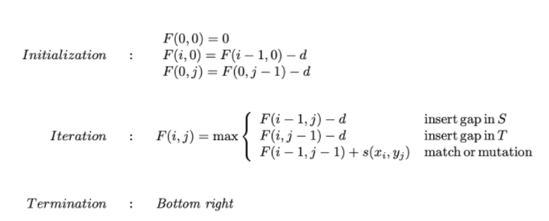

# Global DNA Sequence Alignment using Needleman-Wunsch Algorithm
Tugas CaIRK 2020

Memanfaatkan algoritma Needleman-Wunsch untuk mengetahui penyelarasan/mutasi antar 2 sekuens DNA

## Deskripsi Tugas
Global Sequence Alignment adalah proses membandingkan dua buah atau lebih sekuens DNA, RNA, atau protein untuk mengidentifikasi kemungkinan mutasi yang terjadi dari satu menjadi yang lainnya dengan mempertimbangkan seluruh elemen pada kedua sekuens secara menyeluruh.

<div align="center">


<br>

**Fig 1.** Sequence Alignment Representation

</div>

Salah satu algoritma yang umum digunakan dalam masalah global sequence alignment adalah algoritma Needleman-Wunsch. Algoritma ini memanfaatkan matriks skor untuk menghasilkan global alignment yang optimal. 

Formula pengisian matriks skor yang dilakukan pada Needleman-Wunsch adalah sebagai berikut. Perhatikan juga untuk menyimpan arah/asal skor dihasilkan sebagai penanda dalam traceback nantinya

<div align="center">


<br>

**Fig 2.** Needleman-Wunsch Matrix Scoring Formula

</div>

Keterangan:
```
d: skor gap penalty
s(x; y): skor penyelarasan suatu basa x dari rantai S dengan basa y dari rantai T
F: matrix dimana F (x, y) mengacu pada posisi-x pada S and posisi-y pada T
```

Contoh, hasil matriks F menggunakan algoritma Needleman-Wunsch ditampilkan pada gambar berikut.

<div align="center">


<br>

**Fig 3.** Needleman-Wunsch Matrix Result

</div>

Detail dan penjelasan lebih lengkap dapat anda lihat pada sumber-sumber pada bab [Referensi](#referensi)

Pada tugas ini, kalian akan diminta untuk membuat sebuah program yang mengaplikasikan algoritma Needleman-Wunsch untuk mencari penyelarasan optimal antar 2 rantai DNA lalu menampilkan hasil penyelarasan serta matriks yang digunakan.

## Spesifikasi Wajib (2500 poin)
### Spesifikasi Program (2000 poin)
1. Program dijalankan di terminal
2. Program menerima input berupa dua buah sekuens DNA (Rantai ATCG) yang memiliki perbedaan panjang tidak lebih dari 5 karakter dan masing-masing sekuens minimal memiliki 30 karakter
3. Program dapat dikembangkan dengan bahasa pemrograman apapun
4. Diperbolehkan menggunakan library seperti numpy untuk mempermudah pembentukan matriks dsb. Tetapi, implementasi algoritma from scratch akan sangat dihargai
5. Program dapat menampilkan runtime program, hasil alignment kedua sekuens DNA, matriks hasil algoritma Needleman-Wunsch serta menampilkan rute traceback (boleh ditampilkan terpisah maupun dalam satu matriks yang sama, misalnya dengan memberi warna)
6. Pastikan algoritma Needleman-Wunsch yang kalian implementasikan tetap mengaplikasikan dynamic programming
7. Skema scoring yang digunakan adalah : +1 (match), -1 (mismatch), -2 (gap)

### Spesifikasi Teknis (500 poin)
Tulis sebuah README dalam repository kalian yang berisi hal-hal berikut:
1. Cara penggunaan program
2. Penjelasan singkat tentang algoritma Needleman-Wunsch, minimal memuat:
   - Proses pembuatan matriks
   - Cara memanfaatkan rute traceback matriks dalam menentukan match/mismatch/gap untuk menghasilkan alignment yang optimal
   - Alasan penetapan skema scoring pada bagian Spesifikasi Program poin 7
3. Referensi, framework, dan library yang membantu kalian dalam mengerjakan tugas ini beserta alasan penggunaannya.

Untuk demo, kamu dapat membuat video screen record sederhana dengan voice over menjelaskan algoritma Needleman-Wunsch secara singkat, implementasi algoritma pada program, cara penggunaan program, dan kasus uji program (sekuens DNA 30 karakter, 40 karakter, dan 50 karakter) . Sekalian jelasin ini dong hehe:
1. Matkul IRK fav
2. Dosen & Asisten IRK yang berkesan
3. Pengen jadi asisten matkul apa aja kalau jadi asisten (amin)
4. Ekspektasi pas udah jadi asisten IRK
   
Video diupload ke GDrive atau YouTube (salah satu aja bebas). Kreativitas video tidak dinilai, jadi buat yang simpel saja ya. 

## Spesifikasi Bonus (1000 poin)
Implementasi program dengan GUI bisa dalam bentuk Web maupun Desktop App dengan minimal spesifikasi sebagai berikut :
1. Dapat input 2 sekuens DNA dengan ketentuan yang sama dengan spek wajib (format input dibebaskan dalam bentuk file maupun textbox)
2. Dapat menampilkan runtime program, hasil alignment kedua sekuens DNA, matriks hasil algoritma Needleman-Wunsch serta menampilkan rute traceback (boleh ditampilkan terpisah maupun dalam satu matriks yang sama, misalnya dengan memberi warna atau menyertakan panah arah)
3. Terdapat halaman panduan penggunaan program dan informasi pembuat

## Pengerjaan dan Pengumpulan
1. Buat repository pada Github kalian masing-masing dan invite `dzakimuhammad` ke dalam repository tersebut.
2. Buatlah sebuah issue pada repository ini jika kalian memiliki pertanyaan terkait tugas ini.
3. Pengumpulan dapat dilakukan dengan mengisi [form ini](https://forms.gle/Q7GtkgRbLtToKPYR7)

## Referensi
-  https://www.cs.sjsu.edu/~aid/cs152/NeedlemanWunsch.pdf
-  https://medium.com/analytics-vidhya/sequence-alignment-and-the-needleman-wunsch-algorithm-710c7b1a23a4
-  https://www.youtube.com/watch?v=ipp-pNRIp4g

<div align="center">
<h2><em>Good luck all!</em></h2>
</div>
